#4. Change the current user to root using the command sudo su root. What does the prompt look like?
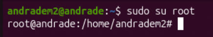

	-It takes us to the root which is indicated by the # as normal users end with $.

#5. While logged in as root, create a new user with the name bobby using the command useradd. Next, create another user with the name sally using the command adduser. What is the difference between the two?
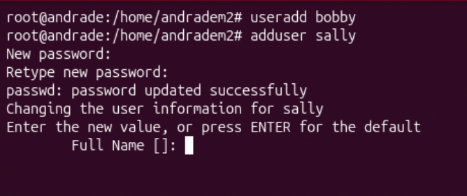

	-useradd is a low level command as it doesn't create a home directory.
	-adduser is a higher level command which creates a home directory and prompts for a password.

#6. Change the current user to sally. What does the prompt look like now?
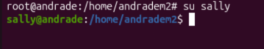

	-The prompt starts with the name of the user and the $ indicates this is a regular user.

#7. While you’re logged in as sally still, try to create a new user with the name earl. What happens? Why? What could you do to allow her to create a new user?
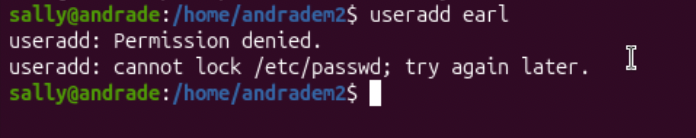

	-Trying to create a new user while logged in as Sally will throw "permission denied" since only the root or sudo user can create users, in order for Sally to add a user she will need to have sudo privileges or log in as root. 

#8. Enter exit until you are logged into your own account again. Delete the user bobby. I didn’t show you the command, but Google it! Learning how to find information is an important skill in CS; It’s impossible to know everything.

	-We'll have use sudo in order to delete a user.

#9. Change the password of sally to something you can remember using sudo passwd sally
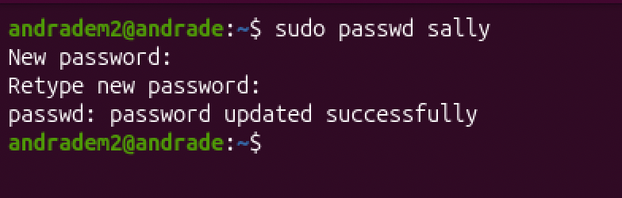

	-In order to change a users password we'll have to use sudo.

#10. Even though it’s easier to complete tasks/commands, why is it bad practice to stay logged in as root?

	- It’s bad because root has unrestricted access to the system, changes can be made with no tracks on who made those changes, also increases the risk on someone gaining access to the system.

#11. Enter the command to see what your user id is.
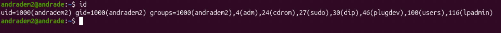

	- The first set is the group id [ uid=2000(andradem2) ]

#12. What groups does ubuntu belong to?

	
	-The third set is the groups the user belongs to: [ - 1000(andradem2), 4(adm), 24(cdrom), 27(sudo), 30(dip), 46(plugdev), 100(users), 116(lpadmin) ]

#13. Give sally the ability to execute sudo commands. Next, try to create a new user while logged in as sally.
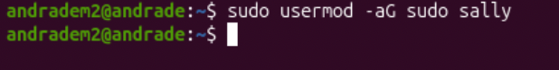

	-In order for Sally to eexecuto sudo commands she needs to be added to the sudo group.

#14. Log out of Sally and back into your own account. Create a new group called

	-Same as creating user when it comes to create groups we also need to use the command sudo.

#15. Add sally to the group, cybersec

	-For a user to be added to group we'll have to run sudo privileges an run the command usermod.
	
	
#16. Check to see which groups sally belongs. What are the various ways to do this?
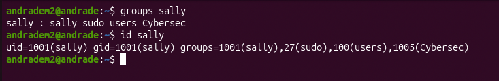

#17. Create a new directory called lab1. Enter the command to find the permissions of the directory. Who is the owner and group owner of this directory? What permissions does the owner, group and other have?
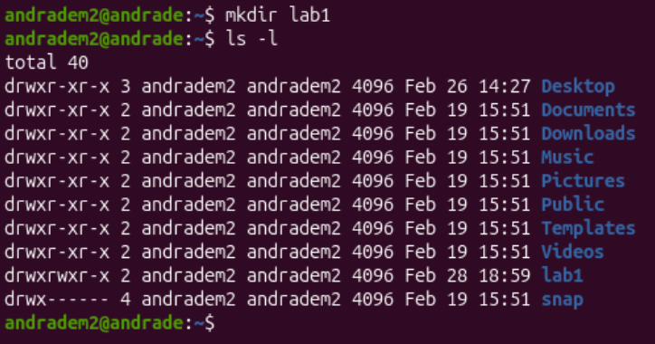

	-The owner is the first set that comes after the permisson sets, in this case andradem2 is the owner of the directory lab1.
	-The first 3 letters in the permssions set are for the owner; [read, write and execute]. 
	-The following 3 are for the groups permissions; [read and execute].
	-The last 3 are for others; [read and execute].

#18. Change your directory to lab1. Create a new bash file called, helloWorld. When ran, your program should just print “Hello World!”. (Don’t forget to make your bash file executable).
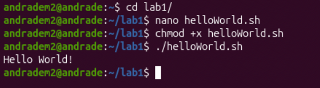

#19. Enter the command ls -l helloWorld. What are the reading, writing, and executing permissions for the owner, group and other?
#a. Change the permissions so the group also has w and x permissions.

#20. Use the getfacl command to view the ACL of the file.
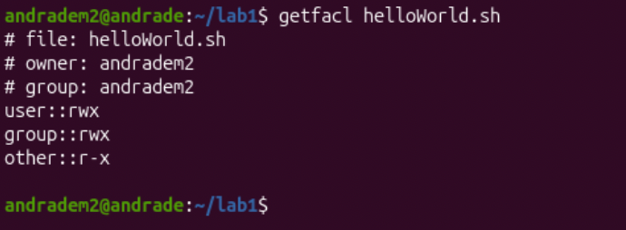

#21. Using the setfacl command, allow the user, sally, the ability to read and write to the file.
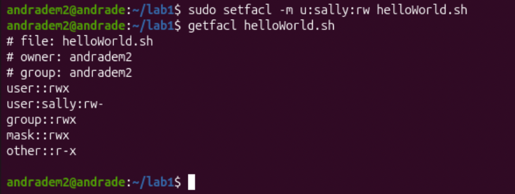

	-In order for sally to have the ability to read and write we use the command setfacl -m u:sally:rw helloWorld. M means modify the file, u is for the user followed by the name fo the user with it's permissions and lastly the name of the file.
