#2.1. Manipulating Environment Variables
Environment variables affect how programs run, they can be modify directly in the shell, impacts the current session and any processes.
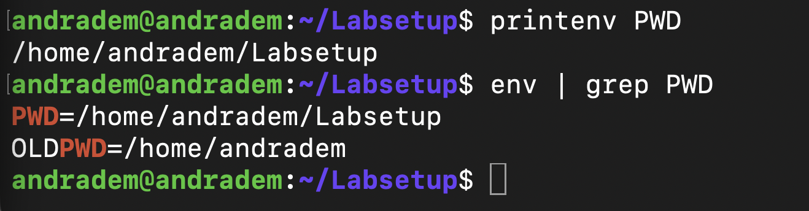

	-printenv / env is used to display all variables in the current shell.
	-printenv PWD is used to check specific variables.

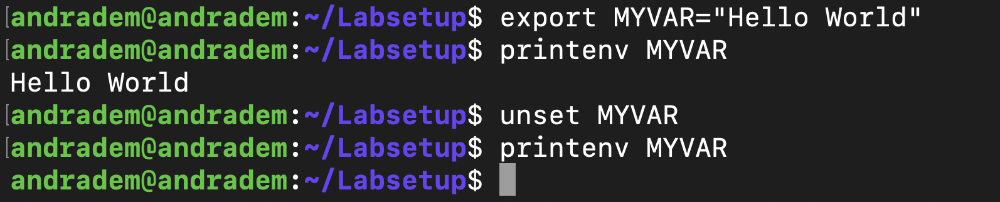

	-The command export is used to create or modify environment variables.
	-The command export is used to delete/remove environment variables.
	
#2.2. Passing Environment Variables from Parent Process to Child Process
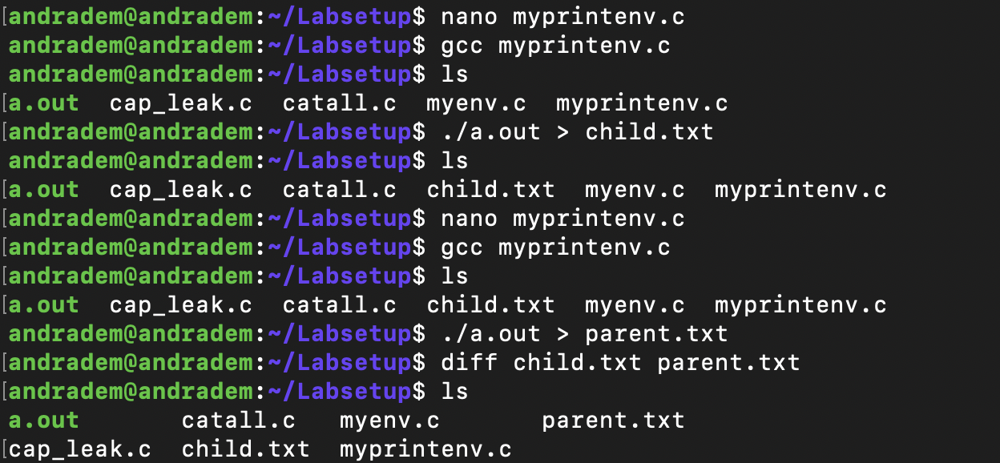

	-First the program was print from the child process.
	-After the modified was modified to print from the parent process.
	-The command diff was used at the end to confirm any differences, which nothing printed stating no difference between the 2 outputs.

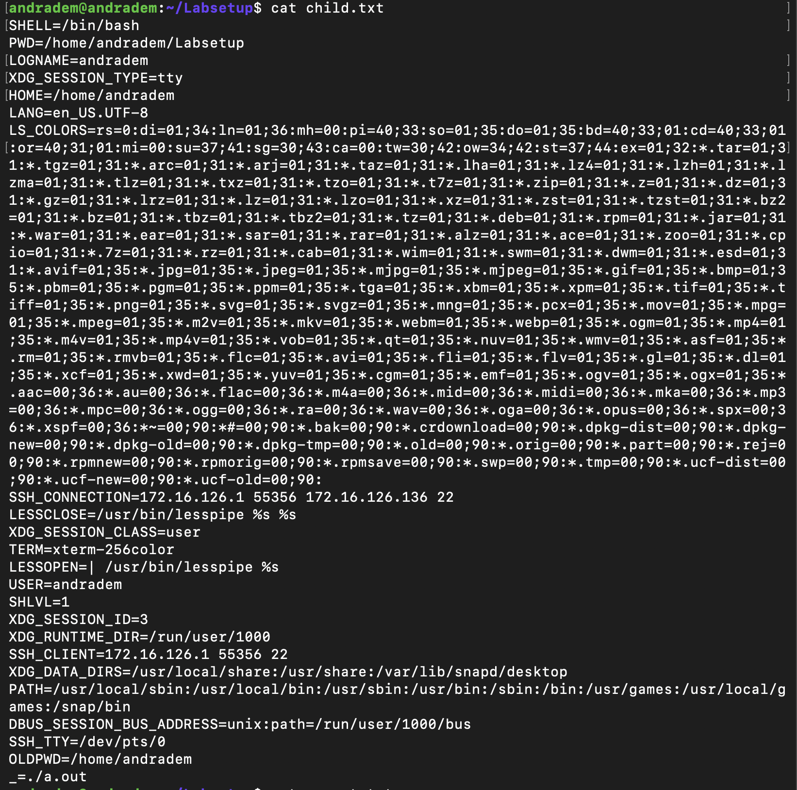

	-The output for the child process.
	
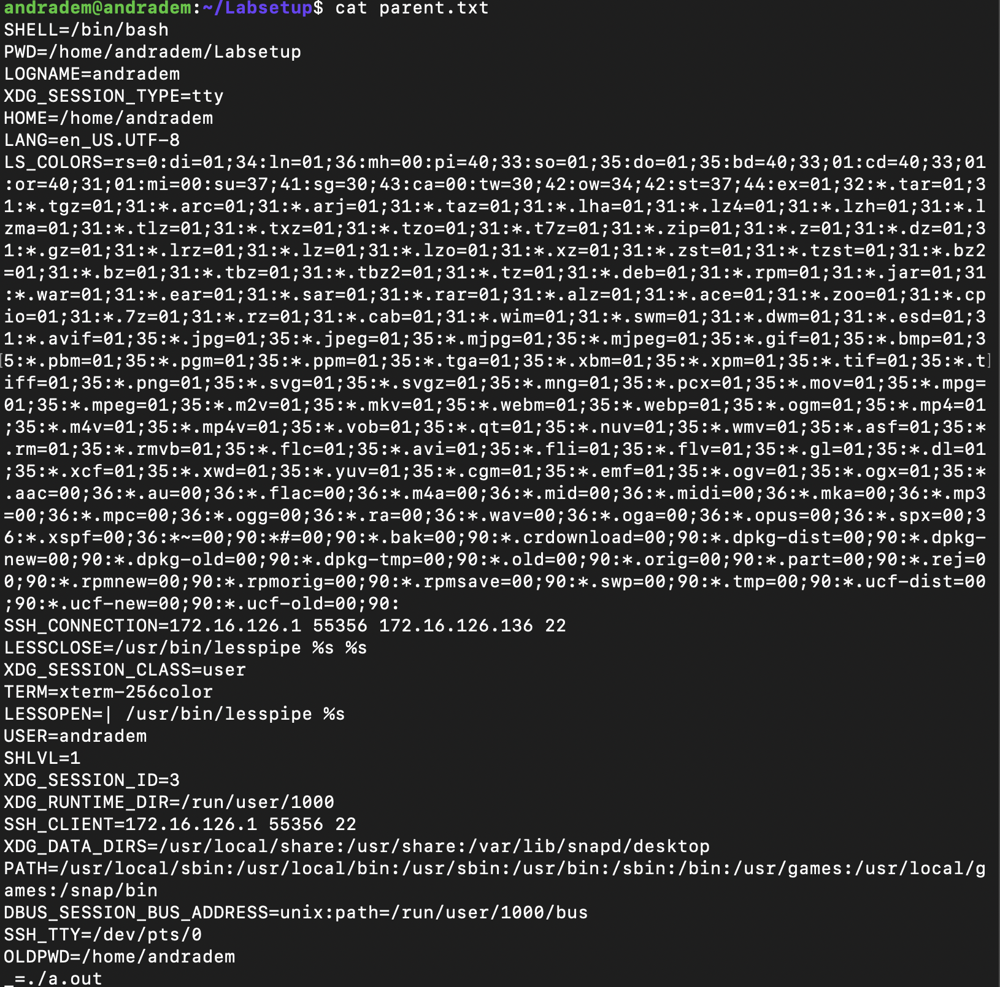

	-The output for the parent process.

#2.3. Environment Variables and execve()
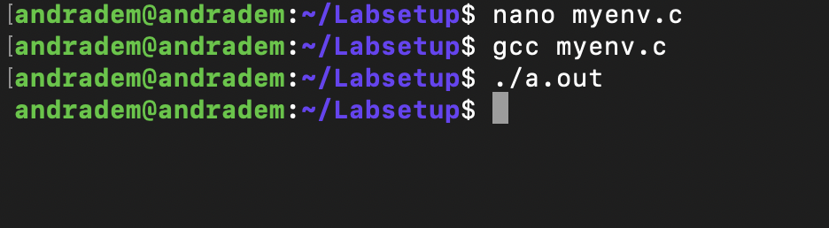

	-First I compile the file myenv.c and after I ran the output file.
	-No output was printed since the program uses NULL which leads the program to have no environment variables.

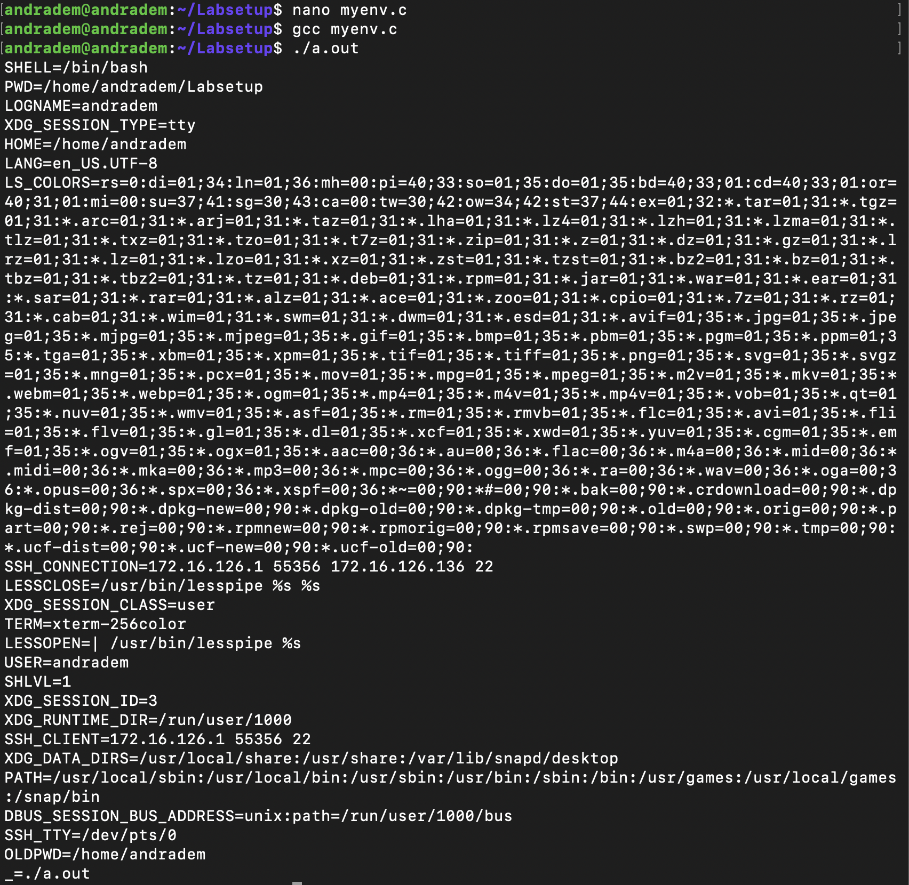

	-The file myenv.c was modified to use environ instead of NULL as the current environment.
	-Environment variables are not automatically inherited by execve() unless is explicitly passed.
	
#2.4. Environment Variables and system()
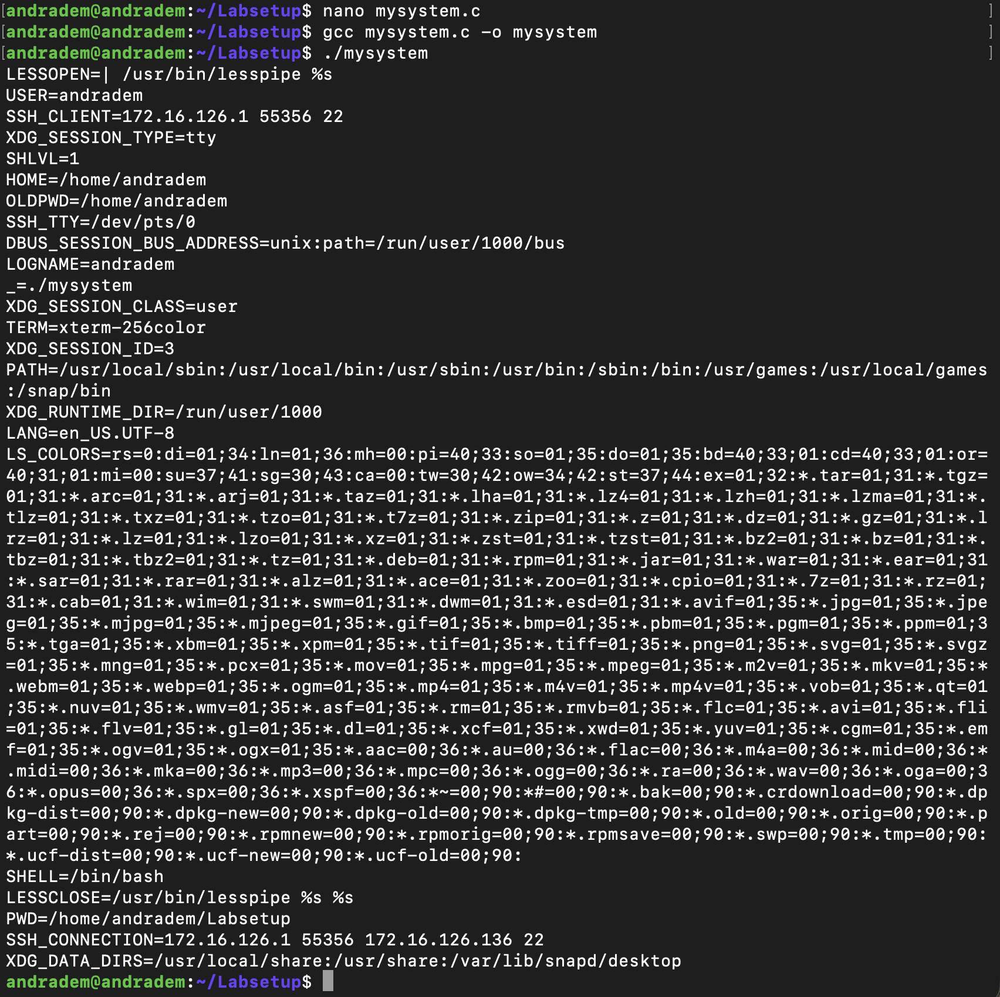

	-The file mysystem.c was compile where system("/usr/bin/env"), the shell inherits the current environment variables.
	-Then the shell executes the command using that environment.

#2.5. Environment Variable and Set-UID Programs
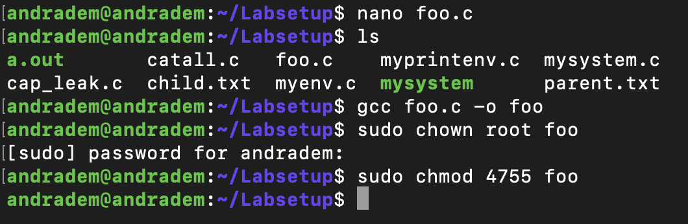

	-I created a SET-UID program that runs with elevated privileges that prints environment variables 
	
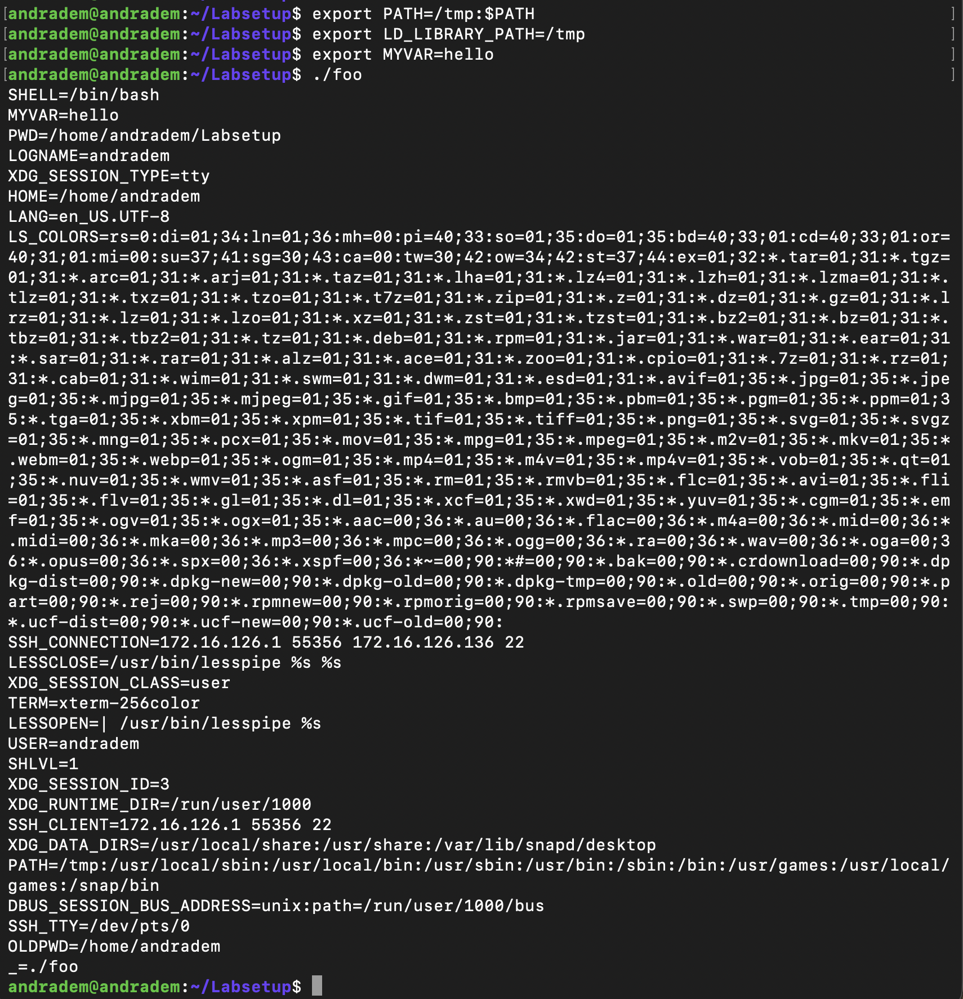

	-As a normal user I set 3 environment variables: 
			*1.export PATH=/tmp:$PATH
			*2.export LD_LIBRARY_PATH=/tmp
			*3export MYVAR=hello
	-As a result not all environment variables were inherited, like LD_LIBRARY_PATH were restricted due to security protections.

#2.6. The PATH Environment Variable and Set-UID Programs
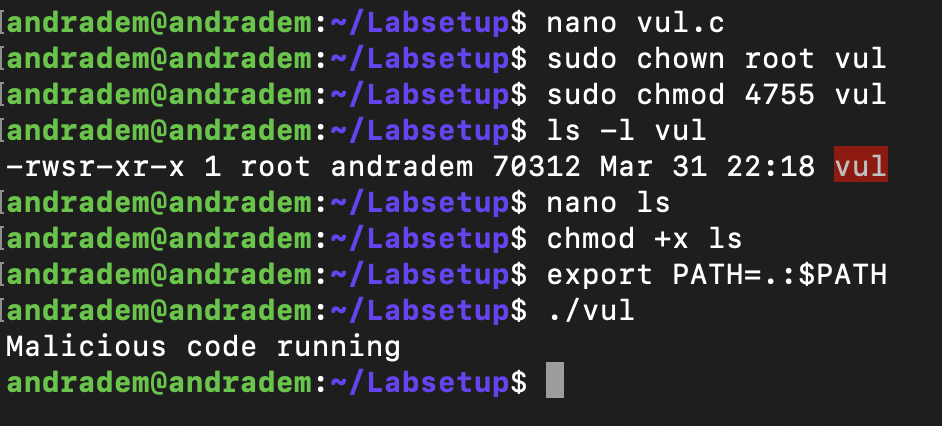

	-First I created the vul.c file, changed the owner to root and set it as a Set-UID program
	-Also created a temp ls file, and gave executable permission.
	-I modified the path environment variable to prioritize the current directory.
	-As a result when running ./vul file, the ls file was executed instead, this happened because the system used the path variable to run the command.
	
	
#2.7. The LD PRELOAD Environment Variable and Set-UID Programs
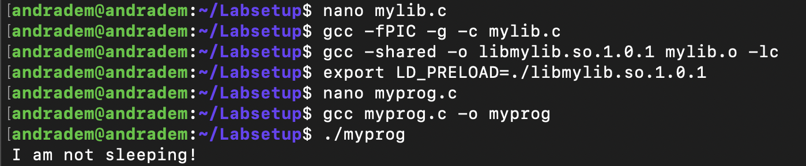

	-First I created the mylib.c file which has a custom implementation to override the sleep() function.
	-The mylib.c file was compile and then created a shared library.
	-The LD_PRELOAD environment variable was set to load my the shared library
	-Also the myprog.c file was created as a test program.
	-As a result, when running myprog the slepp() function form mylib.c was executed because the shared library uses LD_PRELOAD.
	

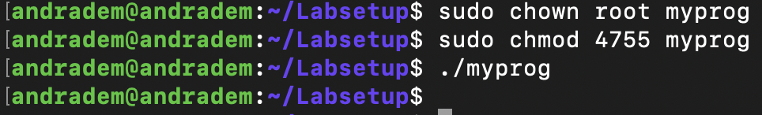
	
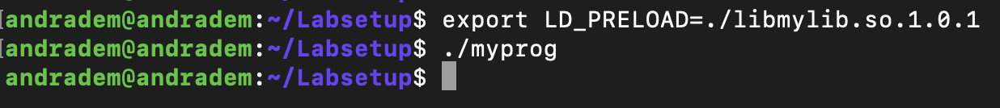

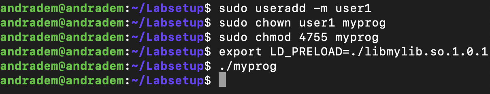

	-First I ran the program as a normal user, and the LD_PRELOAD variable was ignored when the program was ran.
	-After I exported my shared library and ran myprog again, but the shared library was still not used when ran.
	-Lastly I creeated a user, gave myprog ownership to that user and set it as Set-UID program, exported LD_PRELOAD again but it was still ignored when ran.
	-The reason for this outcome its baceuase Set-UID programs dont allow environment variables (like; LD_PRELOAD) to be used.
	
#2.8. Invoking External Programs Using system() versus execve()
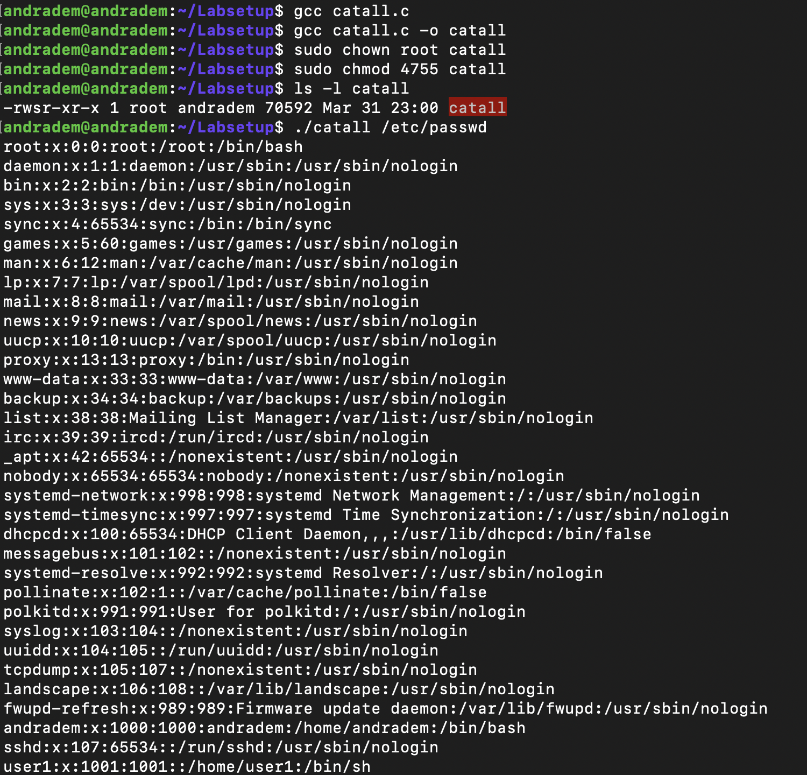

	-

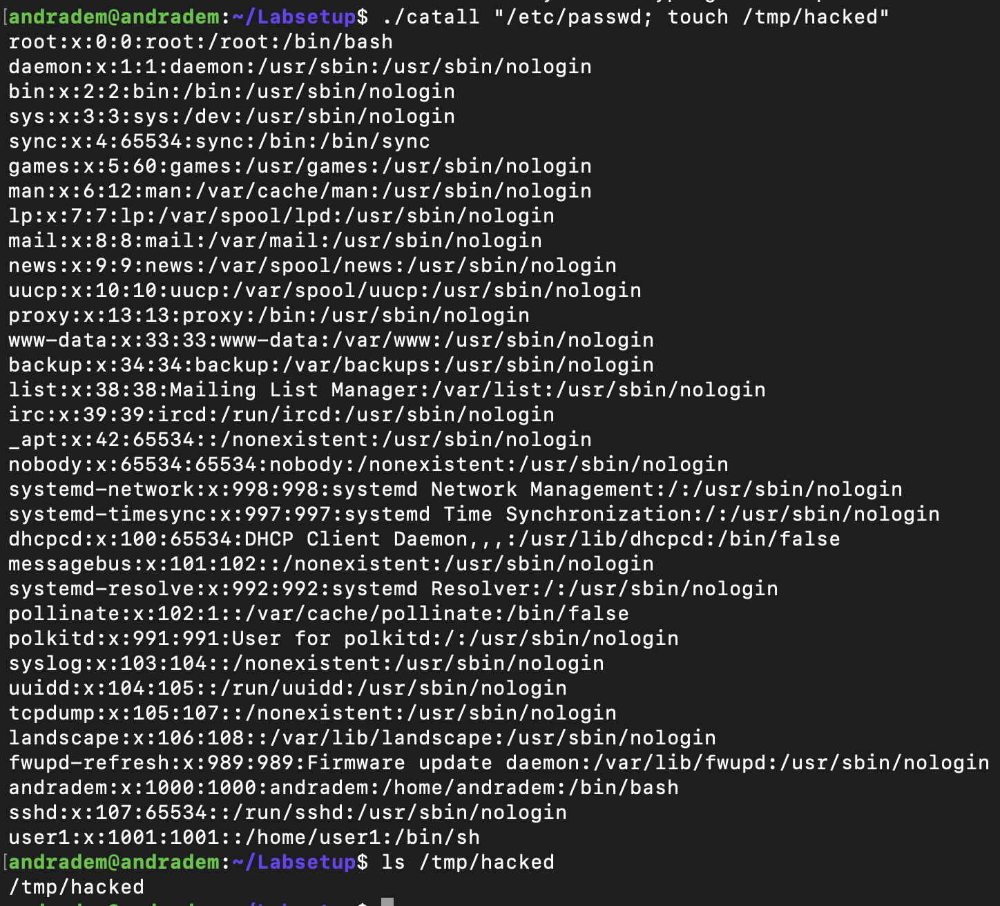

	-	

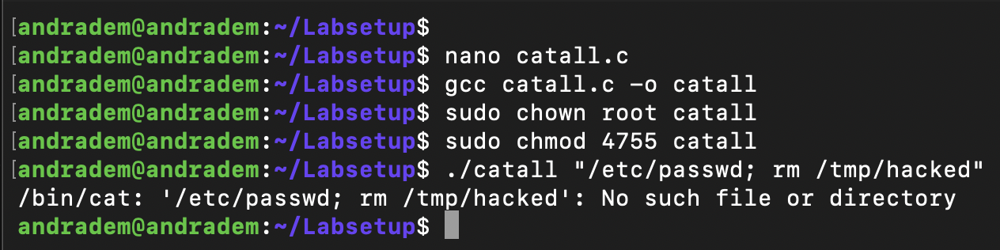

	-	

#2.9. Capability Leaking

	-	
	
	
	
	
	
	
	
	
	
	
	
	
	
	
	
	
	
	
	
	
	
	
	
	
	
	
		
